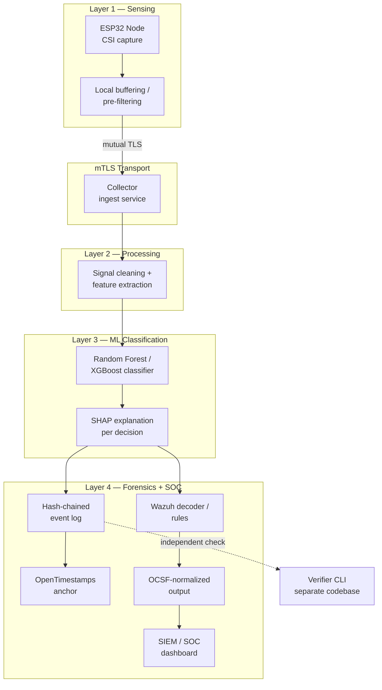

# Sentrix

**Forensics-grade, open-source WiFi CSI intrusion detection.**

Sentrix turns commodity ESP32 hardware into through-wall presence/intrusion sensors — built so its output survives both a SOC analyst's workflow and a courtroom's scrutiny, not just a research demo.

> WiFi CSI sensing itself is a mature, decade-old research field. That is **not** the novelty claim here. What's missing from the existing landscape — including the strongest open competitor, [RuView](https://github.com/ruvnet/ruview) — is a version of CSI sensing built like a security product: mutual authentication between sensor and collector, tamper-evident forensic logging, and native SOC/SIEM correlation. Sentrix's novelty is the **integration** of those three things, not the sensing technology.

## Status

🚧 Pre-v0.1 — active development. See [`docs/ROADMAP.md`](docs/ROADMAP.md) for the full v0.1 → v1.0 plan and [`docs/NON-GOALS.md`](docs/NON-GOALS.md) for explicit scope boundaries.

## Why Sentrix

| Pillar | What it means |
|---|---|
| **Security-first** | mTLS between every sensor node and the collector — no unauthenticated node can inject data |
| **Forensic-grade** | SHA-256 hash-chained event log + OpenTimestamps (Bitcoin-anchored) checkpoints + an independently auditable verifier CLI in a separate codebase |
| **Explainable ML** | Random Forest / XGBoost + SHAP per decision — chosen deliberately over black-box deep learning for Daubert/Frye-defensible evidence |
| **SOC-native** | Native Wazuh decoders/rules + OCSF-normalized output for broader SIEM compatibility |
| **Honestly benchmarked** | Every release ships a dated, reproducible `BENCHMARKS.md` — including the numbers that aren't flattering |

## Architecture



See [`docs/architecture.md`](docs/architecture.md) for the full write-up.

## Repository layout

```
sentrix/
├── firmware/          # ESP32 CSI capture firmware (ESP-IDF)
├── collector/         # mTLS ingest service
├── pipeline/          # Signal processing + feature extraction
├── ml/                # Models + versioned, honest benchmark reports
├── forensics/         # Hash-chain logger + OpenTimestamps client
├── soc-integration/    # Wazuh decoders/rules + OCSF schema mappers
├── verifier-cli/       # Independent verifier — separate trust boundary
├── dataset/           # Scripts + docs for the Zenodo dataset release
└── docs/              # Architecture, threat model, standards alignment, roadmap
```

## Getting started

Full step-by-step setup lives in [`docs/GETTING_STARTED.md`](docs/GETTING_STARTED.md). Short version:

```bash
# Firmware toolchain
git clone -b v5.x https://github.com/espressif/esp-idf.git
cd esp-idf && ./install.sh && . ./export.sh

# Python side
python3 -m venv .venv && source .venv/bin/activate
pip install numpy scipy pandas scikit-learn xgboost shap cryptography
```

## Non-goals

Sentrix is intentionally narrow. It does not try to match RuView's ~105-module breadth, and it is not a general-purpose WiFi sensing research platform. See [`docs/NON-GOALS.md`](docs/NON-GOALS.md).

## Contributing

See [`CONTRIBUTING.md`](CONTRIBUTING.md). Security vulnerabilities should be reported per [`SECURITY.md`](SECURITY.md), not filed as public issues.

## License

Apache License 2.0 — see [`LICENSE`](LICENSE).

## Acknowledgements

Sentrix builds on years of prior CSI-sensing work rather than re-deriving it, including the [ESP32-CSI-Tool](https://github.com/StevenMHernandez/ESP32-CSI-Tool) (Hernandez & Bulut), Espressif's official [esp-csi](https://github.com/espressif/esp-csi), and the broader WiFi sensing research community. See [`docs/standards-alignment.md`](docs/standards-alignment.md) for the full standards and prior-art map.
