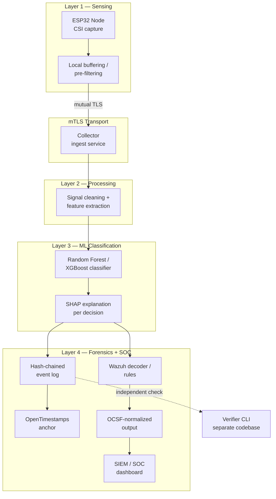

# Vestrix — Project Initialization Guide

*Forensics-grade, open-source WiFi CSI intrusion detection platform — full build reference, v0.1 → v1.0*

**Status:** Living document — update as decisions firm up
**Scope:** A→Z: mission, architecture, stack, security, ML, roadmap, community
**Last updated:** July 8, 2026

> **Ground rule:** Vestrix ships fully open — no paywalled tier, no closed modules, nothing held back. "Complete" means the whole feature set (sensing, ML, forensics, SOC integration) is public from day one of each capability — it does not mean relaxing the honesty-in-benchmarking principle to get there faster.

## Contents
1. Mission & Problem Statement
2. Non-Goals — Explicit Scope Boundaries
3. Core Design Principles
4. Open Source Commitment & Licensing
5. System Architecture
6. Technology Stack
7. Security Controls
8. Forensic Integrity Design
9. ML & Explainability
10. SOC / SIEM Integration
11. Standards Alignment
12. Naming
13. Development Roadmap (v0.1 → v1.0)
14. Repository Structure
15. Getting Started — Step by Step
16. Visibility & Credibility Strategy
17. Contribution & Governance
18. Glossary & References

---

## 1. Mission & Problem Statement

Vestrix turns commodity ESP32 hardware into forensics-grade WiFi CSI (Channel State Information) sensors for intrusion detection — built so its output survives a SOC analyst's workflow *and* a courtroom's scrutiny, not just a research demo.

WiFi CSI sensing itself is a mature, decade-old research field — that is **not** the novelty claim. What's actually missing from the existing tooling landscape, including the strongest open competitor (RuView, github.com/ruvnet/ruview), is:

- **Security-first design** — most CSI tools have no mutual authentication between sensor and collector, so a spoofed node can inject fake data undetected
- **Forensic chain-of-custody** — no tamper-evident logging that would hold up as evidence
- **Native SOC/SIEM integration** — CSI alerts don't flow into the tools analysts already use

Vestrix's novelty is the **integration** of these three things around CSI sensing. Repeat that framing everywhere the project is described publicly — claiming novelty in the sensing itself won't survive scrutiny from the WiFi sensing research community, and it doesn't need to.

## 2. Non-Goals — Explicit Scope Boundaries

- **Not** matching RuView's ~105-module breadth — depth in one defensible niche beats breadth in many shallow ones
- **Not** a general-purpose WiFi sensing research platform — gesture recognition, vital-signs sensing, etc. stay out of scope unless they directly serve intrusion detection
- **Not** claiming production maturity that hasn't been earned — every benchmark shipped is real, dated, and reproducible, even on the days the numbers aren't flattering

Keep this section updated, not deleted, as the project matures. A living non-goals list is part of what keeps the credibility story intact — RuView lost credibility retracting an inflated "100% detection" claim; the antidote is a section like this one, publicly visible.

## 3. Core Design Principles

1. **Security-first** — every design choice defaults to the option that resists tampering and spoofing, even at some cost to convenience
2. **Forensic-grade** — anything Vestrix outputs must be defensible if it ends up in an investigation or a courtroom
3. **Honest benchmarking** — false-positive/false-negative rates are published, dated, and reproducible from v0.1 onward, never smoothed over
4. **Fully open, no gating** — no restricted or paywalled tier, per your direction. Every layer ships open, always
5. **Standards over invention** — wherever NIST, ISO, OCSF, MITRE, or IEEE already has a standard, map to it instead of designing something bespoke

## 4. Open Source Commitment & Licensing

One license, no dual-licensing, no "core vs. enterprise" split.

**Recommended: Apache 2.0**
- Explicit patent grant + patent-retaliation clause — meaningful for a project doing signal-processing/detection work, where patent claims are a realistic risk
- Permissive enough that SOC vendors and enterprises can integrate Vestrix without legal friction — this is what actually gets the "native SOC integration" pillar adopted in the wild
- Requires stating changes to modified files, which keeps forks honestly labeled

**Alternative: AGPLv3** — if the priority is stopping someone from wrapping Vestrix as a closed hosted service without contributing back. Trade-off: some enterprises have blanket no-AGPL policies, which could work against SOC-vendor adoption. (For reference, Wazuh's own core is GPLv2 — not a constraint on your choice, just useful context for the ecosystem you're integrating with.)

*This is general OSS practice, not legal advice — worth a lawyer's quick pass before the v0.1 tag if anything patent-adjacent is in play.*

**Baseline governance files:**
`LICENSE` · `CONTRIBUTING.md` · `CODE_OF_CONDUCT.md` · `SECURITY.md` (vulnerability disclosure — often the first file a serious infosec reviewer checks) · issue/PR templates

## 5. System Architecture



Keep the trust boundaries in the code, not just in the diagram: a broken ML model shouldn't be able to corrupt the forensic log, and a compromised collector shouldn't be able to forge a verified timestamp.

## 6. Technology Stack

| Layer | Component | Technology | Why |
|---|---|---|---|
| Sensing | Firmware | ESP32, ESP-IDF toolchain | Commodity-hardware constraint; ESP-IDF is Espressif's official SDK |
| Sensing | CSI extraction | Build on an established open approach (e.g. the ESP32-CSI-Tool line of work) rather than re-deriving capture | Your effort belongs in security/forensics, not re-proving CSI extraction. Note: proven CSI-callback support is on the original ESP32 chip — verify API parity before committing to a newer variant like S3 |
| Transport | Auth | Mutual TLS, X.509 certs per node | Your own highest-leverage single control — stops spoofed-node data injection |
| Processing | Pipeline | Python — NumPy, SciPy, pandas | Fast iteration, mature signal-processing ecosystem |
| ML | Classifier | scikit-learn (Random Forest), XGBoost | Interpretable, Daubert/Frye-defensible — deliberately not a deep net |
| ML | Explainability | SHAP | Per-decision feature attribution, not just an aggregate accuracy number |
| Forensics | Tamper evidence | SHA-256 hash chain + OpenTimestamps | Free, Bitcoin-anchored, no need to run your own trusted timestamp authority |
| Verification | Independent check | Standalone CLI, separate codebase — Rust or Go recommended | A verifier sharing code with the thing it verifies isn't independent; a small static binary in a different language is easy for a third party to audit line by line |
| SOC/SIEM | Integration | Wazuh custom decoders/rules + OCSF schema output | Native entry into the workflow SOC analysts already use, plus broad SIEM portability |
| Dataset | Publication | Zenodo, DOI | Citable, fills a documented public-dataset gap |

## 7. Security Controls

**mTLS is the anchor control.** Each ESP32 node enrolls with a client certificate issued by a project-run CA; the collector refuses any connection without a valid cert. Plan for rotation and revocation from day one — retrofitting revocation later is painful.

```bash
# Minimal project CA — a starting point, not production-hardened
openssl genrsa -out ca.key 4096
openssl req -x509 -new -key ca.key -days 3650 -out ca.crt -subj "/CN=Vestrix Root CA"

# Per-node certificate
openssl genrsa -out node-07.key 2048
openssl req -new -key node-07.key -out node-07.csr -subj "/CN=node-07"
openssl x509 -req -in node-07.csr -CA ca.crt -CAkey ca.key -CAcreateserial -out node-07.crt -days 365
```

**Threat model** (keep versioned in `docs/threat-model.md`): assume an attacker can (a) physically tamper with or replace a node, (b) attempt to spoof CSI data over the network, (c) attempt to alter stored logs after the fact, (d) attempt to suppress or delay alerts. Every control in this document should map to one of these four.

**MITRE ATT&CK / CAPEC physical mappings**: reuse the mapping already worked out in the research phase — map detected physical-layer events (presence, movement, sensor tamper) to the relevant ATT&CK physical-access techniques and CAPEC physical-security attack patterns, and keep it in `docs/standards-alignment.md` so it's auditable.

## 8. Forensic Integrity Design

**Hash-chained event log** — every event (raw ingestion, classification decision, alert) hashes together with the previous entry's hash, so any retroactive edit breaks the chain:

```json
{
  "event_id": "evt_000482",
  "timestamp_utc": "2026-07-08T09:14:02Z",
  "node_id": "node-07",
  "event_type": "classification_alert",
  "payload_hash": "a1b2c3d4...",
  "shap_summary": { "top_feature": "subcarrier_var_12_18", "contribution": 0.41 },
  "prev_hash": "f9e8d7c6...",
  "entry_hash": "3c4d5e6f..."
}
```

**OpenTimestamps** — periodically anchor the current chain tip to the Bitcoin blockchain (free) for an independently verifiable "this existed before time X" proof that doesn't depend on trusting Vestrix's own clock.

**Independent verifier CLI** — a separate, minimal codebase whose only job is: given a log file and a timestamp proof, confirm the chain is unbroken and the anchor is valid. No shared code with the main pipeline — the entire point is that someone who doesn't trust the main Vestrix codebase can still trust the verification.

**Chain-of-custody documentation** — every exported forensic report auto-generates a custody log: who/what pulled the data, when, with the verifier's output attached.

## 9. ML & Explainability

**Why not deep learning**: a neural net's decision boundary is very hard to explain to a judge, opposing counsel, or a SOC analyst under time pressure. Random Forest / XGBoost give feature-level explanations that map to physical reality — "this fired because of CSI amplitude variance in subcarriers 12–18 over a 3-second window," not "hidden layer 47 activated."

**SHAP on every logged decision** — not just aggregate model accuracy. The per-decision explanation is what makes the output defensible later.

**Validation methodology**: a true held-out test set the model never sees during development; cross-validation *and* held-out performance reported separately; adversarial-condition testing (e.g. someone deliberately moving slowly to evade detection), documented even when the model performs badly there — that's the honest-benchmarking principle in practice.

**Benchmark publishing**: every release ships a `BENCHMARKS.md` — dataset used, methodology, FP rate, FN rate, date. Never overwrite old numbers; version them so the improvement (or regression) history stays visible.

## 10. SOC / SIEM Integration

**Wazuh first** — this is the "native SOC integration" pillar of the whole novelty claim, so it needs to work smoothly, not just technically exist:

```xml
<!-- decoder — illustrative starting point -->
<decoder name="vestrix">
  <prematch>vestrix_alert:</prematch>
</decoder>
<decoder name="vestrix_fields">
  <parent>vestrix</parent>
  <regex>node_id=(\S+) severity=(\S+) shap_top=(\S+)</regex>
  <order>node_id, severity, shap_top</order>
</decoder>
```
```xml
<!-- rule — illustrative starting point -->
<rule id="100201" level="10">
  <decoded_as>vestrix</decoded_as>
  <description>Vestrix CSI intrusion alert: $(shap_top)</description>
  <group>vestrix,physical_security,</group>
</rule>
```

**OCSF output** — normalize the same alert into OCSF (Open Cybersecurity Schema Framework) so any OCSF-compatible SIEM beyond Wazuh can ingest it without a bespoke integration. Design the alert payload once internally, then map it to Wazuh's format and OCSF from that single representation — don't maintain two schemas that can drift apart. (The exact OCSF class/field mapping for a physical-sensing event is a real design decision worth its own short doc — don't guess at field names under deadline pressure.)

## 11. Standards Alignment

| Standard | Relevance |
|---|---|
| NIST SP 800-86 | Guide to integrating forensic techniques into incident response — shapes how forensic output is structured |
| ISO/IEC 27037 | Identification, collection, acquisition, and preservation of digital evidence — shapes chain-of-custody design |
| ISO/IEC 27041–27043 | Investigative method adequacy, evidence analysis/interpretation, incident investigation process — shapes documentation and reporting |
| OCSF | Output schema for SIEM interoperability |
| MITRE ATT&CK / CAPEC | Physical-access technique / attack-pattern mapping |
| IEEE 802.11bf | The emerging WLAN Sensing standard — track it; aligning early is a credibility signal to the WiFi sensing research community |

## 12. Naming

Not finalized. Don't let the rest of the build wait on it, but don't skip it either — a name change after a public v0.1 is expensive.

**Ruled out:** "Sentinel" — collides with Microsoft Sentinel.

**Shortlist for reference:**
- CSI double-meaning: TrueCSI, ChainCSI, VeraCSI
- RF/signal-security: Waveguard, Etherwitness, Airtrace
- Forensics-first: Evidentia, Attestor, Custodia
- Brandable: Vigilon, Custodex

**Before committing, verify for the top 2–3 candidates:**
- [ ] GitHub org/repo name available
- [ ] Package registry name available (PyPI for the Python pieces; crates.io or npm depending on the verifier CLI's language)
- [ ] Domain available (.dev / .io / .org)
- [ ] No trademark collision with an existing security product

## 13. Development Roadmap (v0.1 → v1.0)

| Tier | Version | Focus | Key deliverables | Exit criteria |
|---|---|---|---|---|
| 0 | v0.1 | Core capture & pipeline | ESP32 firmware, raw ingest, basic visualization | Reliable CSI stream from ≥1 node reaches the collector |
| 1 | v0.2–v0.3 | Baseline detection | Feature extraction, Random Forest baseline | Reproducible benchmark report published, however unflattering |
| 2 | v0.4–v0.5 | Security hardening | mTLS enrollment/rotation, hash-chained log | No unauthenticated node can inject data; tamper-evidence verified |
| 3 | v0.6–v0.7 | SOC + explainability | XGBoost option, SHAP, Wazuh decoders/rules, OCSF output | Alerts show up, explained, inside a real Wazuh instance |
| 4 | v0.8–v0.9 | Independent verification + dataset | Verifier CLI, OpenTimestamps anchoring, labeled dataset live on Zenodo with DOI | A third party can verify a log without running Vestrix itself |
| 5 | v1.0 | Credibility push | Full docs, published threat model, Arsenal/DFRWS submission-ready | External reviewer feedback incorporated |

This is a reconstruction consistent with everything already locked in — adjust tier boundaries freely if the original roadmap doc has more specific version cuts in mind.

## 14. Repository Structure

```
vestrix/
├── firmware/                 # ESP32 CSI capture firmware (ESP-IDF)
│   ├── main/
│   └── components/
├── collector/                 # mTLS ingest service
├── pipeline/                  # Signal processing + feature extraction
├── ml/
│   ├── models/
│   └── benchmarks/            # Versioned, honest FP/FN reports — never overwritten
├── forensics/                 # Hash-chain logger + OpenTimestamps client
├── soc-integration/
│   ├── wazuh/                 # Decoders + rules
│   └── ocsf/                  # Schema mappers
├── verifier-cli/               # Independent verifier — separate trust boundary
├── dataset/                   # Scripts + docs for the Zenodo release
├── docs/
│   ├── architecture.md
│   ├── threat-model.md
│   └── standards-alignment.md
├── CONTRIBUTING.md
├── SECURITY.md
├── CODE_OF_CONDUCT.md
├── LICENSE
└── README.md
```

`verifier-cli/` deliberately stays as close to a separate package as possible — its own dependency tree, ideally its own repo once it stabilizes.

## 15. Getting Started — Step by Step

**1. Environment**
```bash
# Firmware toolchain
git clone -b v5.x https://github.com/espressif/esp-idf.git
cd esp-idf && ./install.sh && . ./export.sh

# Python side
python3 -m venv .venv && source .venv/bin/activate
pip install numpy scipy pandas scikit-learn xgboost shap cryptography
```

**2. First node** — `idf.py create-project vestrix-node`, wire in CSI capture, `idf.py -p /dev/ttyUSB0 flash monitor` to confirm raw frames reach a throwaway dev collector (no security yet — just prove the pipeline).

**3. mTLS** — stand up the project CA (openssl commands in §7), issue a node cert, require the collector to reject anything unsigned.

**4. Processing + baseline ML** — build the feature-extraction module, train Random Forest on a small labeled set, publish the first (honest, likely rough) `BENCHMARKS.md`.

**5. Forensic logging** — implement the hash chain, wire in an OpenTimestamps client for periodic anchoring.

**6. SOC integration** — write the first Wazuh decoder + rule, add the OCSF mapper off the same internal alert schema.

**7. Verifier CLI** — build the independent verifier as its own codebase: chain integrity + timestamp check, nothing else.

**8. Tests + CI** — unit tests for hash-chain integrity are non-negotiable; GitHub Actions running lint + tests on every PR.

**9. Docs** — README, architecture diagram, threat model, standards alignment — all before the public v0.1 tag, not after.

**10. Dataset + visibility** — record labeled intrusion scenarios, publish to Zenodo with a DOI once the labeling methodology is solid enough to trust.

## 16. Visibility & Credibility Strategy

- **Zenodo dataset + DOI** — publish as soon as the labeling methodology is solid; this is a citable academic artifact independent of the software's maturity, so it can go out even before v1.0
- **Black Hat Arsenal** (Black Hat's live open-source tool demo track) — target once mTLS and forensic logging both work end-to-end; Arsenal audiences want a working tool, not a roadmap
- **DFRWS** (Digital Forensics Research Workshop) — target once the forensic-admissibility story (SHAP + hash chain + OpenTimestamps + verifier CLI) is complete; this audience will genuinely stress-test the "forensic-grade" claim, so don't submit before it's real
- **Public benchmark honesty** — every public post links to the current `BENCHMARKS.md` rather than just quoting a number in prose; that's the credibility differentiator versus RuView's retracted claim

## 17. Contribution & Governance

- `CONTRIBUTING.md` — environment setup (link to §15), coding standards, how to add a Wazuh rule / OCSF mapping / firmware feature, how benchmark PRs get reviewed (numbers must be reproducible from a documented dataset + script, not hand-reported)
- **Governance for now** — single maintainer, open contribution model; revisit a formal core-team structure once there are recurring outside contributors
- **Security disclosure** — `SECURITY.md` with a private, monitored contact (email or GitHub Security Advisories) for vulnerability reports — essential for a security tool to actually have a working channel

## 18. Glossary & References

- **CSI (Channel State Information)** — fine-grained WiFi signal data describing how the signal is altered by the environment; the raw sensing substrate
- **mTLS** — mutual TLS; both client and server present certificates, not just the server
- **OCSF** — Open Cybersecurity Schema Framework, a vendor-neutral event schema for SIEM interoperability
- **Daubert / Frye** — the two dominant U.S. legal standards for admitting expert/scientific evidence; part of why interpretable ML matters here
- **OpenTimestamps** — a free protocol for anchoring a hash to the Bitcoin blockchain as proof data existed at or before a given time
- **RuView** — closest open competitor, github.com/ruvnet/ruview; reference point, not a target to imitate

---

*Document history: v1 — 2026-07-08 — initial consolidated draft. Suggested home once the repo is live: `docs/INITIALIZATION.md` or the repo root.*
