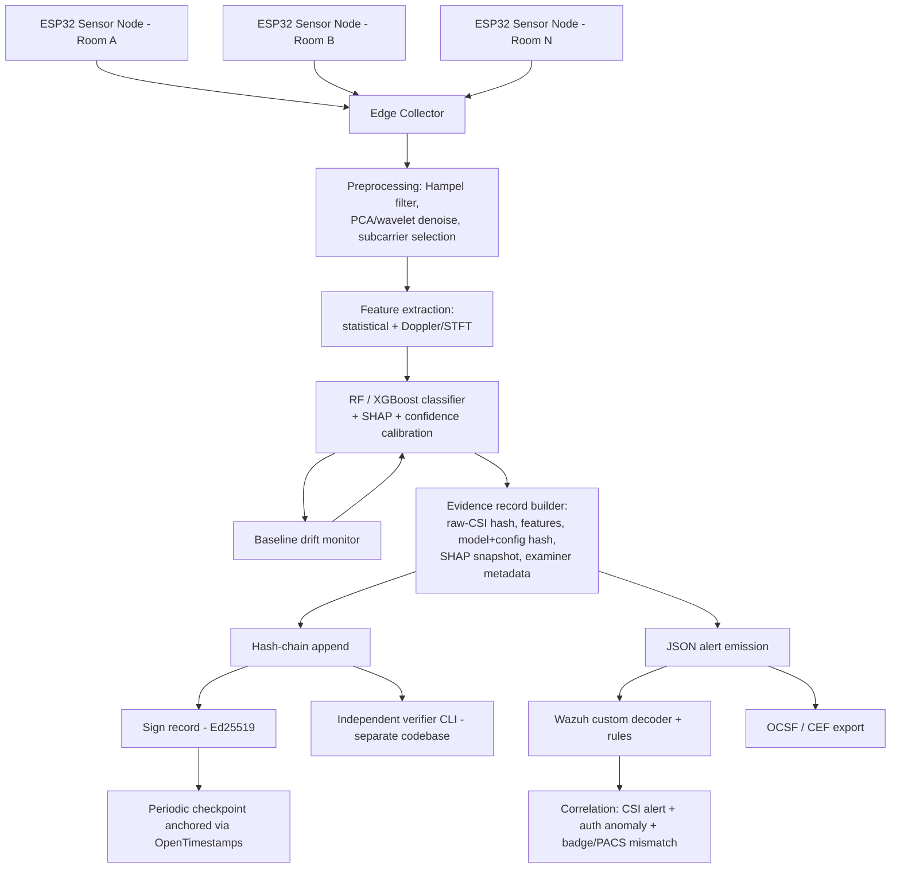

# Sentrix — Research & Roadmap
### Turning a strong idea into a defensible, citable, category-defining open-source security tool

*Compiled from current academic literature, standards documents, and prior-art analysis. Last updated July 2026.*

---

## 0. How to use this document

This isn't a wishlist — every recommendation below is tied to a real paper, standard, or existing tool, listed in §12. Treat it as a working reference: copy it into `docs/ROADMAP.md` in your repo, strike things out as you build them, and use §12 as your citation list when you eventually write this up (you should — see §9).

---

## 1. The honest positioning (read this section first)

Your own design principle — *"honestly reported accuracy... no inflated benchmarks... no marketing claims"* — has to apply to the novelty claim too, or the first serious infosec person who looks at Sentrix will tear it apart in the GitHub issues. Here's the accurate version, and it's still a strong pitch:

| Claim | Verdict | Why |
|---|---|---|
| "WiFi CSI sensing" is new | ❌ False | 10+ years of academic research; commodity through-wall presence detection is well established |
| "ESP32 CSI extraction" is new | ❌ False | Hernandez's `ESP32-CSI-Tool` and Espressif's official `esp-csi` have existed for years |
| "ML-classified WiFi presence detection" is new | ❌ False | Random Forest/XGBoost/CNN on CSI is standard practice across dozens of papers |
| "Open-source WiFi motion sensing" is new | ❌ False | ESPectre (~4k GitHub stars) already does this for smart homes |
| "Security-first, forensic-grade, SOC-native WiFi-CSI IDS" | ✅ **Genuinely open** | No project — open or commercial — combines all three. This is your real claim. |

**Your pitch should be:** *"The sensing technology is 10 years old. What doesn't exist is a version of it built like a security product instead of a smart-home gadget — with a defensible evidence trail and a place in the SOC's correlation engine."* That's a narrower claim, but it's true, and true claims survive scrutiny. It also happens to map exactly onto your three fields (§8).

---

## 2. Prior art & competitive landscape

| Project                                                                                             | Type               | Sensing               | ML                                | Forensic logging               | SOC/SIEM            | Scope                                                               |
| --------------------------------------------------------------------------------------------------- | ------------------ | --------------------- | --------------------------------- | ------------------------------ | ------------------- | ------------------------------------------------------------------- |
| **ESPectre** (F. Pace)                                                                              | Open source, GPLv3 | ESP32 CSI, MVS/PCA    | None by design (statistical only) | None                           | None                | Home Assistant automation                                           |
| **Cognitive Systems Aura / WiFi Motion**                                                            | Commercial, closed | Router-based CSI/RSSI | Proprietary ML                    | None published                 | None                | Consumer home security                                              |
| **Academic CSI-HAR systems** (TW-See, attention-enhanced through-wall models, WiFi-DensePose, etc.) | Research code      | CSI, various          | CNN/attention/deep models         | None                           | None                | Pose, vitals, gesture, health — security is one use-case among many |
| **Sentrix (proposed)**                                                                              | Open source        | ESP32 CSI             | RF/XGBoost, explainable           | Hash-chained, chain-of-custody | Native Wazuh + OCSF | Security only, narrow scope                                         |

Some specifics worth knowing before you build:

- **Hernandez & Bulut** (the ESP32-CSI-Tool authors) have already published directly on your threat model: *"Adversarial Occupancy Monitoring using One-Sided Through-Wall WiFi Sensing"* and *"Scheduled Spatial Sensing against Adversarial WiFi Sensing"* — read both before writing your threat-model doc.
- Espressif's official `esp-csi` repo lists **ESPectre as a recognized community reference implementation**, and separately ships a `wifi_sensing_demo` — worth reviewing so you're not duplicating Espressif's own reference code.
- ESP32 CSI **phase data is notoriously noisy** (no hardware synchronization between TX/RX oscillators) — nearly every published ESP32-CSI paper uses **amplitude-only spectrograms**. If you build phase-based features, budget real time for phase sanitization/calibration, or explicitly document why you skipped it.

---

## 3. Reference architecture



Key architectural principle: **the verifier (L) must be a separate, minimal codebase from the collector.** A chain-of-custody log that can only be checked by the same system that wrote it is forensically weak — this mirrors why Crosby & Wallach's Merkle-tree scheme assumes an *untrusted* logger from the outset.

---

## 4. Feature roadmap, by tier

### Tier 0 — Harden the core sensing + ML pipeline
- Amplitude-based spectrograms as primary signal (phase treated as experimental/optional)
- Hampel filter + PCA or wavelet denoising for outlier/noise rejection
- Null/pilot subcarrier removal per the 802.11 spec you're targeting
- Statistical features (variance, skewness, kurtosis, entropy) per subcarrier/window, plus Doppler/STFT-based features for motion vs. static presence
- **Confidence calibration** (Platt scaling or isotonic regression) — raw softmax/tree-vote scores are not calibrated probabilities, and your SOC correlation rules (Tier 2) need real probabilities, not just a label

### Tier 1 — Forensic evidence layer (your actual differentiator)
This is where you should spend the most engineering effort — it's the part nobody else has:
- **Model provenance in the evidence chain**: every alert logs the exact model version hash + config hash used, not just the verdict. Years later, an investigator can prove exactly which model produced a given call.
- **Raw evidence retention**: keep a hash of (and ideally the compressed raw) CSI window behind each alert, not just derived features — mirrors the network-forensics principle of keeping full pcap, not just NetFlow summaries.
- **SHAP/feature-importance snapshot per alert** — this is your Daubert/Frye insurance policy (see §7).
- **Hash-chained, append-only log** per Schneier & Kelsey's forward-secure audit log design, or the more efficient Merkle-tree variant (Crosby & Wallach, USENIX Security '09) if you expect high alert volume.
- **Independent verifier CLI**, deliberately kept in a separate minimal codebase from the main collector.
- **Periodic Bitcoin-anchored checkpoints via OpenTimestamps** — free, decentralized, doesn't require anyone to trust your infrastructure, and gives you a genuinely strong "this evidence could not have been backdated" claim at zero recurring cost.
- **Signed evidence export** (JSON manifest, optionally rendered as a PDF incident report) modeled on the chain-of-custody fields recommended in NIST SP 800-86 / ISO-IEC 27037 comparisons: evidence item, source device, collection time, collector identity, transfer history, hash values, any condition changes.

Minimal illustrative record structure (not production code — a starting point):

```python
import hashlib, json

def make_record(prev_hash: str, event: dict, signer) -> dict:
    record = {
        "seq": event["seq"],
        "ts_utc": event["ts_utc"],              # NTP-synced capture time
        "node_id": event["node_id"],              # signed sensor identity
        "raw_csi_hash": event["raw_csi_hash"],    # sha256 of raw CSI window
        "features_hash": event["features_hash"],
        "model_id": event["model_id"],            # e.g. "rf_v1.4.2"
        "model_config_hash": event["model_config_hash"],
        "class": event["class"],
        "confidence": event["confidence"],
        "top_shap": event["top_shap"],            # explainability snapshot
        "prev_hash": prev_hash,
    }
    record_bytes = json.dumps(record, sort_keys=True).encode()
    record["record_hash"] = hashlib.sha256(record_bytes).hexdigest()
    record["signature"] = signer.sign(record_bytes)  # Ed25519 recommended
    return record
```

### Tier 2 — SOC/SIEM native integration
- Emit **JSON**, not free-text — Wazuh's JSON decoder is far more robust than regex-based decoders for a growing schema.
- Ship a native decoder + rule group (`sentrix, physical_intrusion`) so users get correlation out of the box:

```xml
<!-- decoders/local_decoder.xml -->
<decoder name="sentrix"><prematch>"source": "sentrix"</prematch></decoder>
<decoder name="sentrix_json">
  <parent>sentrix</parent>
  <plugin_decoder>JSON_Decoder</plugin_decoder>
</decoder>
```
```xml
<!-- rules/local_rules.xml (illustrative — validate with wazuh-logtest) -->
<group name="sentrix,physical_intrusion,">
  <rule id="100201" level="10">
    <decoded_as>sentrix_json</decoded_as>
    <field name="class">intrusion</field>
    <description>Sentrix: high-confidence physical intrusion, zone $(zone)</description>
  </rule>
  <rule id="100202" level="14">
    <if_matched_sid>100201</if_matched_sid>
    <description>Sentrix intrusion correlated with an authentication anomaly</description>
  </rule>
</group>
```
- Don't lock yourself to Wazuh: also ship an **OCSF-formatted** output profile. OCSF (now under the Linux Foundation, backed by AWS/Splunk/CrowdStrike/Broadcom and others) is rapidly becoming the industry-standard schema for security events — supporting it means Splunk, Elastic, and Sentinel users can ingest Sentrix too, not just Wazuh shops.
- Because there's no existing ATT&CK/CAPEC technique family for *physical* intrusion detection specifically (CAPEC has a "Physical" attack category, but it's thin), consider publishing your own small **physical-access correlation taxonomy** — a genuinely citable contribution in its own right.
- Concrete correlation rules to ship as examples: (a) CSI alert + failed VPN/auth logins from the same site in a short window → composite high-confidence alert; (b) CSI alert with no corresponding badge/PACS swipe → unauthorized-entry alert; (c) a sensor-tamper event correlated with any alert suppression → possible adversarial interference.

### Tier 3 — Security *of* the security tool
- **mTLS or signed packets between sensor node and collector.** Without this, anyone on the same LAN segment could inject spoofed "all clear" CSI to suppress real alerts — undermining the entire system. This is arguably your single highest-leverage security control.
- **Tamper switch on sensor enclosures** feeding its own hash-chained "sensor tamper" event type — physical tampering with a sensor becomes forensic evidence itself.
- Signed firmware updates for the ESP32 nodes; RBAC on the dashboard/API.

### Tier 4 — Privacy & responsible-use layer
Through-wall sensing is a real privacy concern even without cameras, and this isn't just an ethics footnote — it's a **sales blocker** if you ever target enterprise SOC customers:
- If deployed to monitor a workplace, **GDPR Article 35 treats systematic employee monitoring as requiring a Data Protection Impact Assessment (DPIA)** in the EU — this has produced real fines (e.g., a €32M CNIL penalty in 2024 for deploying employee monitoring without one). The 2024/1689 EU AI Act layers on top for AI-driven monitoring specifically.
- Ship a **DPIA template + "Responsible Deployment" doc** as part of the repo — occupant notification guidance, a visible "sensor active" indicator, data-minimization defaults (don't retain raw CSI longer than needed for evidentiary purposes). This turns a compliance obligation your enterprise customers already have into something you hand them pre-filled — a genuine adoption accelerator, not just goodwill.

### Tier 5 — Moonshot / research-grade contributions
- **Multi-node fusion for zone-level localization** (not just binary presence) using trilateration across ESP32 nodes.
- **Release a labeled, ethics-reviewed "intrusion" CSI dataset** with a Zenodo DOI. Nearly all public CSI datasets (Widar3.0, SignFi, UT-HAR, CSI-Bench, WiMANS) target activity recognition or health, not adversarial/breach scenarios — a well-documented security-specific dataset is a genuine, citable gap-fill and a strong companion to a paper submission (§9).
- Track **IEEE 802.11bf** (the newly ratified WLAN Sensing amendment, approved 2024) as a long-term hardware-portability target — it explicitly lists security and privacy as candidate technical features, and migrating beyond ESP32-only tricks as 802.11bf-capable chipsets appear would broaden your hardware support considerably.

---

## 5. The rigor playbook — how to avoid the "inflated benchmark" trap

This is the single most-cited failure mode in CSI-sensing research, and it directly threatens your "honestly reported accuracy" promise if you don't design around it from day one:

1. **Never report same-room train/test accuracy as your headline number.** Models here reach ~100% training accuracy while generalization collapses — this is documented across multiple domain-shift studies, not a one-off finding.
2. **A 2024 Nokia Bell Labs paper found literal data leakage** in a widely-used public CSI benchmark, caused by including the same subjects' signals in both train and test splits. Audit your own splits explicitly for this before publishing any number.
3. **Report leave-one-room-out and leave-one-device-out accuracy, not just in-distribution accuracy.** Cross-device generalization is specifically flagged as the weakest axis in recent large-scale CSI benchmarking work.
4. **Publish confusion matrices and per-environment breakdowns, not single aggregate numbers.** A single "94% accurate" headline hides exactly the information a security buyer needs.
5. **Re-validate after any hardware or firmware revision** — CSI characteristics are sensitive to the specific radio, not just the room.

---

## 6. Documented threat model

Since "documented threat model, no marketing claims" is already one of your stated goals, here's what the literature says you should acknowledge — at the category level, which is exactly the right level of detail for a published threat model (specific exploit engineering doesn't belong in user-facing docs anyway):

| Category | What the literature documents | Your mitigation |
|---|---|---|
| Environmental drift | Furniture moves, temperature/humidity, neighboring WiFi churn degrade accuracy over time | Baseline drift monitor + scheduled re-calibration, logged as its own event type |
| Cross-domain failure | Models trained in one room/device often fail in another — a well-established open problem, not a bug you introduced | Leave-one-room-out validation (§5), documented per-environment accuracy |
| Adversarial evasion | Published attacks include context-aware spoofing and metasurface-based signal manipulation designed specifically to defeat WiFi-based intrusion detection, and CSI-targeted adversarial perturbation attacks achieving high targeted-misclassification rates in lab conditions | Document as a known, published limitation class; don't overclaim adversarial robustness you haven't tested |
| Stream injection | An attacker on the same network segment could inject fabricated "clear" CSI if sensor↔collector isn't authenticated | mTLS/signed packets (Tier 3) — treat this as a hard requirement, not optional hardening |
| Physical tamper | Sensor hardware itself can be disabled or removed | Tamper switch feeding the hash chain (Tier 3) |
| Fundamental sensing limits | Motion-based sensing (WiFi, PIR, ultrasonic alike) has well-known, publicly documented limitations around very slow or minimal movement | State plainly, the same way any alarm vendor documents PIR limitations — this is standard, expected disclosure, not a vulnerability you're revealing |

---

## 7. Standards alignment map

| Standard / body of work | What it gives you | Where it applies |
|---|---|---|
| Schneier & Kelsey (1999), Crosby & Wallach (2009) | Canonical hash-chain / Merkle-tree tamper-evident logging design | Evidence layer (Tier 1) |
| NIST SP 800-86 | Four-phase forensic process: collection → examination → analysis → reporting | Overall evidence pipeline design |
| ISO/IEC 27037 | Evidence identification, collection, acquisition, preservation best practice | Evidence handling procedures docs |
| OpenTimestamps | Free, decentralized, Bitcoin-anchored proof-of-existence | Periodic checkpoint anchoring |
| OCSF (Linux Foundation) | Vendor-neutral security event schema | Alert export format, alongside native Wazuh |
| MITRE CAPEC ("Physical" category) | Existing but thin coverage of physical attack patterns | Basis for your own physical-intrusion taxonomy contribution |
| Daubert / Frye standards, FRE 602/403, proposed FRE 707 | Courts require known/testable error rates and explainability for algorithmic evidence | Justifies RF/XGBoost + SHAP over black-box deep models |
| GDPR Art. 35, EU AI Act 2024/1689 | DPIA required for systematic monitoring; workplace monitoring AI treated as high-risk | Responsible-use pack (Tier 4) |
| IEEE 802.11bf (ratified 2024) | Standardizes WiFi sensing across chipsets, lists security/privacy as a design consideration | Long-term hardware-portability roadmap |

---

## 8. How this maps onto your exact background

You asked for this explicitly, so here it is as a direct table — this is also almost verbatim the pitch you should use in your README's "why me" section:

| Capability | Cybersecurity / SOC | Machine Learning | Digital Forensics |
|---|---|---|---|
| Hash-chained evidence log | ✓ tamper-evident audit trail | — | ✓ chain of custody |
| SHAP-explained RF/XGBoost | — | ✓ model design & validation | ✓ Daubert-defensible evidence |
| Wazuh decoders + OCSF export | ✓ SOC correlation engineering | — | — |
| Documented threat model | ✓ adversary-aware design | ✓ model robustness limits | ✓ scope-of-evidence statement |
| Cross-environment validation protocol | — | ✓ rigorous ML methodology | ✓ reproducibility for court/audit |
| OpenTimestamps anchoring | ✓ infrastructure security | — | ✓ non-repudiable timestamping |

---

## 9. Visibility & credibility strategy (concrete, sequenced)

"Famous" in this niche looks like *respected and cited*, not viral — and that's actually easier to engineer deliberately:

1. **GitHub hygiene first**: a README with a 10-second demo GIF, an architecture diagram, and honestly-reported per-environment metrics (not one inflated headline number) will outperform hype every time with this audience.
2. **Black Hat Arsenal** — an open-source tool showcase with a standing Call for Tools; submissions require only a working code repo, no payment, and are reviewed purely on merit. A very natural fit for Sentrix.
3. **DEF CON demo labs / BSides talks** — lower barrier to entry than Black Hat, good for early traction and feedback.
4. **DFRWS (Digital Forensics Research Workshop)** — has a lightweight "Practitioner Presentations & Demos" track (a ~500-word proposal, not a full paper) that's a much easier on-ramp than academic peer review, and full research papers are published in *Forensic Science International: Digital Investigation* (Elsevier) if you later want to formalize the forensic-logging design as a paper — squarely in your wheelhouse given your background.
5. **Release the intrusion dataset (Tier 5) with a Zenodo DOI.** Datasets get cited independently of your tool adoption — this is a durable, compounding form of visibility that a single flashy launch post isn't.
6. **arXiv preprint** on the hash-chain + SHAP evidentiary design specifically — this is a genuinely novel-enough systems contribution (forensic ML explainability + SOC correlation) to stand alone from the sensing technology.
7. **Submit the Wazuh ruleset upstream** / list it in the Wazuh community integrations — instant distribution to every Wazuh deployment.
8. **Awesome-lists** — PR into `awesome-wifi-sensing`-style lists and general awesome-cybersecurity/forensics lists once the repo is demo-ready.

---

## 10. Suggested milestones

| Version | Focus |
|---|---|
| v0.1 | Single-node presence detection, RF classifier, plain JSON logging |
| v0.2 | Hash-chained logging + independent verifier CLI |
| v0.3 | Wazuh decoder/rules + docker-compose demo environment |
| v0.4 | mTLS sensor↔collector auth + tamper-switch event type |
| v0.5 | Leave-one-room-out validation suite + published per-environment metrics |
| v0.6 | Documented threat model + OpenTimestamps anchoring |
| v0.7 | OCSF export profile + multi-node zone fusion |
| v0.8 | Public intrusion dataset release (Zenodo DOI) + DPIA/responsible-use pack |
| v1.0 | Black Hat Arsenal / DFRWS submission + arXiv preprint |

---

## 11. A licensing note

ESPectre uses GPLv3 (copyleft — derivative works must stay open). If broad enterprise/commercial adoption matters more to you than guaranteeing all downstream forks stay open, Apache-2.0 or MIT will see faster adoption in SOC tooling contexts (Wazuh itself is GPLv2, for reference). Worth a deliberate choice rather than a default.

---

## 12. References

**CSI sensing & ESP32 tooling**
- Hernandez & Bulut, ESP32-CSI-Tool — https://github.com/StevenMHernandez/ESP32-CSI-Tool
- Espressif, esp-csi (official) — https://github.com/espressif/esp-csi
- ESPectre (F. Pace) — https://github.com/francescopace/espectre
- Hernandez & Bulut, "WiFi Sensing on the Edge" (IEEE COMST 2022) — https://stevenmhernandez.github.io/ESP32-CSI-Tool/
- "WiFi CSI-Based Long-Range Through-Wall HAR with the ESP32" — https://link.springer.com/chapter/10.1007/978-3-031-44137-0_4 / dataset: https://zenodo.org/records/8021099
- TW-See through-wall HAR — https://www.researchgate.net/publication/373201458
- Attention-enhanced through-wall presence detection — https://arxiv.org/pdf/2304.13105

**Standards**
- IEEE 802.11bf overview — https://arxiv.org/pdf/2207.04859 ; NIST paper — https://www.nist.gov/publications/ieee-80211bf-enabling-widespread-adoption-wi-fi-sensing
- OCSF — https://ocsf.io/ , https://schema.ocsf.io/ , Linux Foundation announcement — https://www.linuxfoundation.org/press/open-cybersecurity-schema-framework-ocsf-joins-the-linux-foundation-to-optimize-critical-security-data

**Generalization / rigor**
- Data augmentation for cross-domain CSI HAR — https://arxiv.org/pdf/2401.00964
- CSI-Bench (large-scale, OOD evaluation) — https://arxiv.org/html/2505.21866v1
- SenseFi library/benchmark, overfitting analysis — https://arxiv.org/pdf/2207.07859
- Varga, "Mitigating Data Leakage in a WiFi CSI Benchmark" (Sensors 2024) — https://www.ncbi.nlm.nih.gov/pmc/articles/PMC11679234/

**Adversarial / secure sensing**
- "A Survey on Secure WiFi Sensing Technology: Attacks and Defenses" (Sensors 2025) — https://www.mdpi.com/1424-8220/25/6/1913
- Hernandez & Bulut, "Adversarial Occupancy Monitoring using One-Sided Through-Wall WiFi Sensing" — https://www.researchgate.net/publication/353788666
- Wi-Spoof — https://dl.acm.org/doi/10.1016/j.jisa.2025.104052

**Tamper-evident logging / forensics**
- Schneier & Kelsey, "Secure Audit Logs to Support Computer Forensics" (1999) — https://dl.acm.org/doi/10.1145/317087.317089
- Crosby & Wallach, "Efficient Data Structures for Tamper-Evident Logging" — https://www.usenix.org/legacy/event/sec09/tech/slides/crosby.pdf
- NIST SP 800-86 — https://csrc.nist.gov/pubs/sp/800/86/final
- NIST SP 800-86 vs ISO/IEC 27037 comparison — https://www.researchgate.net/publication/382816264
- OpenTimestamps — https://opentimestamps.org/

**Legal admissibility / explainability**
- Magnet Forensics, "Evaluating the use of AI in digital evidence and courtroom admissibility" — https://www.magnetforensics.com/blog/evaluating-the-use-of-ai-in-digital-evidence-and-courtroom-admissibility/
- "Explainable AI for Digital Forensics" — https://www.forensicscijournal.com/journals/jfsr/jfsr-aid1089.php

**SOC/SIEM**
- Wazuh custom decoders/rules docs — https://documentation.wazuh.com/current/user-manual/ruleset/decoders/custom.html

**Privacy**
- GDPR Art. 35 DPIA for employee monitoring — https://www.employee-monitoring.net/use-cases/data-protection-officer-employee-monitoring-dpia

**Visibility venues**
- Black Hat Arsenal CFP — https://usa-arsenal-cfp.blackhat.com/
- DFRWS — https://dfrws.org/

---

*This document reflects the literature as of July 2026. WiFi sensing standards (802.11bf rollout) and the OCSF schema are both actively evolving — re-check before finalizing anything version-dependent.*
