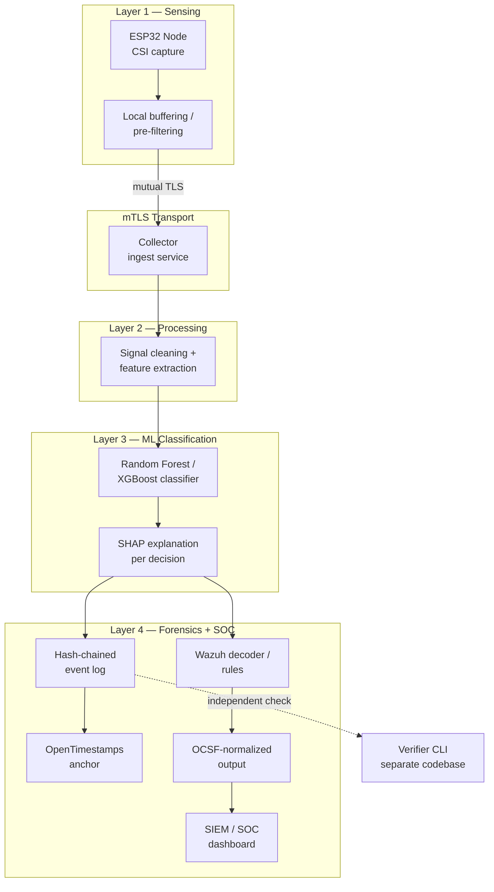

# Architecture

## Overview

## Trust boundaries

These must be enforced in code, not just implied by the diagram:

1. **A broken or compromised ML model must not be able to corrupt the forensic log.** The evidence layer only ever receives a classification result plus its SHAP snapshot — it has no ability to rewrite history, only append to it.
2. **A compromised collector must not be able to forge a verified timestamp.** OpenTimestamps anchoring and verification happen independently of the collector's own trust.
3. **The verifier CLI shares no code with the collector or pipeline.** A chain-of-custody log that can only be checked by the system that wrote it is forensically weak.

## Layer responsibilities

| Layer | Responsibility | Key components |
|---|---|---|
| 1 — Sensing | Raw CSI capture from ESP32 hardware, local pre-filtering | `firmware/` |
| Transport | Mutual TLS between every node and the collector | `collector/` (server side), per-node certs |
| 2 — Processing | Signal cleaning (Hampel filter, PCA/wavelet denoise), feature extraction | `pipeline/` |
| 3 — ML | Classification (Random Forest / XGBoost) + SHAP explanation per decision | `ml/` |
| 4 — Forensics + SOC | Hash-chained logging, OpenTimestamps anchoring, Wazuh + OCSF output | `forensics/`, `soc-integration/` |
| Verification | Independent chain + timestamp check | `verifier-cli/` |

## Data flow contract

Each ESP32 node → collector transmission is authenticated via mTLS. The collector emits a single internal alert representation per classified event; this representation is the one source of truth that gets (a) hash-chained into the forensic log, (b) mapped to the Wazuh decoder format, and (c) mapped to OCSF — the mappings are derived from one schema, not maintained as two independently drifting ones.

See `docs/threat-model.md` for the adversary model each of these boundaries defends against, and `docs/standards-alignment.md` for how each piece maps to an existing standard rather than inventing something bespoke.
